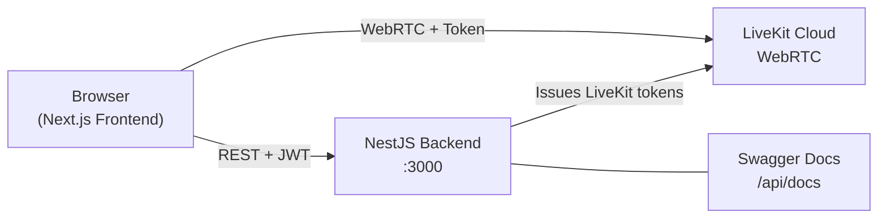

# VidBitye

**VidBitye** is a modern, browser-based video conferencing web application. It provides authentication, meeting scheduling, instant meetings, and a full-featured in-call experience powered by [LiveKit](https://livekit.io/).

This repository contains the **frontend** — a [Next.js](https://nextjs.org/) app that talks to a separately deployed **NestJS backend** over HTTP and connects to **LiveKit** for real-time audio, video, screen sharing, and in-call chat.

---

## Table of Contents

- [Overview](#overview)
- [Features](#features)
- [Architecture](#architecture)
- [Tech Stack](#tech-stack)
- [Prerequisites](#prerequisites)
- [Quick Start](#quick-start)
- [Environment Variables](#environment-variables)
- [Available Scripts](#available-scripts)
- [Project Structure](#project-structure)
- [Routes & Pages](#routes--pages)
- [Backend API Integration](#backend-api-integration)
- [Authentication](#authentication)
- [Meetings](#meetings)
- [Meeting Room UI](#meeting-room-ui)
- [Docker](#docker)
- [Deployment](#deployment)
- [Development Guidelines](#development-guidelines)
- [Troubleshooting](#troubleshooting)
- [Related Repositories](#related-repositories)
- [License](#license)

---

## Overview

VidBitye is built as an MVP video conferencing platform with a clean, responsive UI. Users can register, log in, create or join meetings, and participate in HD video calls directly from the browser — no plugins required.

| Component | Role | Default URL |
|-----------|------|-------------|
| **Frontend** (this repo) | Next.js web app | `http://localhost:3001` |
| **Backend** (NestJS) | REST API, auth, meeting lifecycle | `http://localhost:3000` |
| **LiveKit** | WebRTC media server | `wss://your-project.livekit.cloud` |
| **API Docs** (Swagger) | OpenAPI documentation | `http://localhost:3000/api/docs` |

> **Port note:** The frontend intentionally runs on **3001** so it does not conflict with the NestJS backend on **3000**.

---

## Features

### Authentication
- User registration and login
- Forgot password / reset password flows
- JWT access tokens with automatic silent refresh
- Session persistence across page reloads (refresh token in `sessionStorage`)
- Protected routes with client-side guards

### Dashboard
- List upcoming, live, and recent meetings
- **Start instant meeting** — one-click room creation via `POST /meetings/instant`
- **Schedule meeting** — create meetings with optional date/time
- **Join by code** — enter a shareable meeting code (e.g. `abc-defg-hij`)

### Meeting Room
- Full-screen immersive call UI (dark theme)
- HD video and audio via LiveKit
- Adaptive video grid (single participant fills the viewport)
- Screen sharing
- In-call chat over LiveKit data channels
- Floating control dock (mic, camera, screen share, participants, chat, leave)
- Host controls: mute/remove participants, end meeting for all
- Copy meeting code from the in-call top bar

### Settings
- Update user profile (first name, last name)

### Landing Page
- Marketing homepage with feature highlights and sign-up CTAs

---

## Architecture



**Typical join flow:**

1. User authenticates → backend returns `accessToken` + `refreshToken`
2. User creates or joins a meeting → frontend calls backend REST API
3. Frontend requests a LiveKit token → `POST /meetings/{code}/token`
4. LiveKit React SDK connects to the media server
5. In-call chat uses LiveKit data channels (not persisted server-side)

---

## Tech Stack

| Layer | Technology |
|-------|------------|
| Framework | Next.js 16 (App Router) |
| Language | TypeScript 5 |
| UI | Tailwind CSS v4, Radix UI primitives, ShadCN-style components |
| Icons | Lucide React |
| Forms | React Hook Form + Zod |
| Client state | Zustand |
| Real-time media | LiveKit Client + `@livekit/components-react` |
| Toasts | Sonner |
| Fonts | Geist Sans / Geist Mono |

---

## Prerequisites

Before running the frontend, ensure you have:

- **Node.js** 20.x or later
- **npm** 9+ (or compatible package manager)
- A running **VidBitye NestJS backend** (see backend repository)
- A **LiveKit** project (Cloud or self-hosted) with credentials configured on the backend

Optional:

- **Docker** & **Docker Compose** for containerized runs

---

## Quick Start

### 1. Clone the repository

```bash
git clone https://github.com/YOUR_ORG/vidbitye.git
cd vidbitye
```

### 2. Install dependencies

```bash
npm install
```

### 3. Configure environment variables

```bash
cp .env.example .env.local
```

Edit `.env.local`:

```env
NEXT_PUBLIC_API_URL=http://localhost:3000
NEXT_PUBLIC_LIVEKIT_URL=wss://your-project.livekit.cloud
```

> `NEXT_PUBLIC_*` variables are embedded in the client bundle at **build time**. They must be URLs reachable from the **user's browser**, not from the server container.

### 4. Start the backend

Run the NestJS API on port **3000**. Confirm it is healthy:

```bash
curl http://localhost:3000/api/docs-json
```

Open interactive API docs at **[http://localhost:3000/api/docs](http://localhost:3000/api/docs)**.

### 5. Start the frontend

```bash
npm run dev
```

Open **[http://localhost:3001](http://localhost:3001)**.

### 6. Create an account and test

1. Go to `/register` and create an account
2. You will be redirected to the dashboard
3. Click **Start instant meeting** or schedule a meeting
4. Allow camera/microphone permissions when prompted

---

## Environment Variables

| Variable | Required | Description | Example |
|----------|----------|-------------|---------|
| `NEXT_PUBLIC_API_URL` | Yes | Base URL of the NestJS REST API | `http://localhost:3000` |
| `NEXT_PUBLIC_LIVEKIT_URL` | Yes | LiveKit WebSocket URL (fallback if not returned by token API) | `wss://your-project.livekit.cloud` |

### Docker-only variable

| Variable | Default | Description |
|----------|---------|-------------|
| `FRONTEND_PORT` | `3001` | Host port mapped to the container |

Copy `.env.example` to `.env` for Docker Compose, or `.env.local` for local `npm run dev`.

**Security:** Never commit `.env`, `.env.local`, or files containing secrets. The repo `.gitignore` excludes `.env*`.

---

## Available Scripts

| Command | Description |
|---------|-------------|
| `npm run dev` | Start development server on port **3001** with hot reload |
| `npm run build` | Production build (standalone output) |
| `npm run start` | Start production server (run `build` first) |
| `npm run lint` | Run ESLint |

---

## Project Structure

```
vidbitye/
├── src/
│   ├── app/                      # Next.js App Router pages
│   │   ├── page.tsx              # Landing page (/)
│   │   ├── login/                # Sign in
│   │   ├── register/             # Sign up
│   │   ├── forgot-password/      # Password reset request
│   │   ├── reset-password/       # Password reset form
│   │   ├── dashboard/            # Meeting hub
│   │   ├── meetings/new/         # Schedule a meeting
│   │   ├── meeting/[code]/       # Live meeting room
│   │   ├── settings/             # Profile settings
│   │   ├── layout.tsx            # Root layout, providers
│   │   └── globals.css           # Tailwind + design tokens
│   │
│   ├── components/
│   │   ├── layout/               # AppHeader, shared layout
│   │   ├── providers/            # AuthProvider, AuthGuard, ProtectedRoute
│   │   └── ui/                   # Button, Input, Card, Alert, etc.
│   │
│   ├── features/
│   │   ├── auth/                 # Login, register, password forms
│   │   ├── meetings/             # Dashboard, cards, instant meeting, join form
│   │   ├── call-room/            # Video grid, controls, chat, participants
│   │   └── settings/             # Profile form
│   │
│   ├── services/                 # API wrappers (auth, meetings, users)
│   ├── store/                    # Zustand stores (auth, ui)
│   ├── hooks/                    # useAuth, useStartInstantMeeting
│   ├── types/                    # TypeScript DTOs
│   ├── lib/                      # api-client, schemas, utils, constants
│   └── middleware.ts             # Route matcher (pass-through; guards in client)
│
├── public/                       # Static assets
├── Dockerfile                    # Production multi-stage build
├── Dockerfile.dev                # Development container with hot reload
├── docker-compose.yml            # Production + dev profiles
├── next.config.ts                # Standalone output for Docker
├── .env.example                  # Environment template
└── package.json
```

---

## Routes & Pages

| Route | Access | Description |
|-------|--------|-------------|
| `/` | Public | Landing page |
| `/login` | Public | Sign in |
| `/register` | Public | Create account |
| `/forgot-password` | Public | Request reset email |
| `/reset-password` | Public | Set new password (token in query) |
| `/dashboard` | Protected | Meeting list, instant start, join by code |
| `/meetings/new` | Protected | Schedule or create a titled meeting |
| `/meeting/[code]` | Protected | Full-screen video call room |
| `/settings` | Protected | Update profile |

Route protection is enforced client-side via `AuthProvider`, `AuthGuard`, and `ProtectedRoute` in `src/components/providers/auth-provider.tsx`.

---

## Backend API Integration

The frontend communicates with the NestJS backend through `src/lib/api-client.ts` and service modules in `src/services/`.

**Base URL:** `NEXT_PUBLIC_API_URL` (default `http://localhost:3000`)

**Interactive docs:** [http://localhost:3000/api/docs](http://localhost:3000/api/docs)

### Auth endpoints

| Method | Path | Purpose |
|--------|------|---------|
| `POST` | `/auth/register` | Register new user |
| `POST` | `/auth/login` | Login → `{ user, accessToken, refreshToken }` |
| `POST` | `/auth/refresh` | Refresh tokens → `{ accessToken, refreshToken }` |
| `POST` | `/auth/logout` | Revoke refresh token |
| `POST` | `/auth/forgot-password` | Send reset email |
| `POST` | `/auth/reset-password` | Reset password with token |

### User endpoints

| Method | Path | Purpose |
|--------|------|---------|
| `GET` | `/users/me` | Get current user profile |
| `PATCH` | `/users/me` | Update profile |

### Meeting endpoints

| Method | Path | Purpose |
|--------|------|---------|
| `POST` | `/meetings` | Create scheduled meeting `{ title, scheduledFor? }` |
| `POST` | `/meetings/instant` | Create instant meeting `{ title? }` |
| `GET` | `/meetings` | List user's meetings |
| `GET` | `/meetings/{idOrCode}` | Get meeting by UUID or shareable code |
| `POST` | `/meetings/{idOrCode}/token` | Get LiveKit token + URL |
| `POST` | `/meetings/{idOrCode}/start` | Start meeting (host) |
| `POST` | `/meetings/{idOrCode}/end` | End meeting (host) |
| `POST` | `/meetings/{idOrCode}/leave` | Leave meeting |
| `POST` | `/meetings/{idOrCode}/participants/{identity}/mute` | Mute participant `{ muted: boolean }` |
| `POST` | `/meetings/{idOrCode}/participants/{identity}/remove` | Remove participant |

Meeting identifiers accept either the database **UUID** or the human-readable **meeting code** (normalized to lowercase). See `src/lib/meeting-mapper.ts`.

### API client behavior

- Sends `Authorization: Bearer <accessToken>` on authenticated requests
- Uses `credentials: "include"` for cookie compatibility
- On **401**, attempts one silent token refresh, then retries the request
- Throws typed `ApiError` with message and status code

---

## Authentication

### Token storage strategy

| Token | Storage | Rationale |
|-------|---------|-----------|
| Access token | Zustand (in-memory) | Reduces XSS exfiltration risk |
| Refresh token | `sessionStorage` | Survives page reload within the same tab |

On app load, `AuthProvider` reads the refresh token from `sessionStorage`, calls `POST /auth/refresh`, fetches `/users/me`, and restores the session.

### Session lifecycle

```
Login → setAuth(user, accessToken, refreshToken)
      → refresh token saved to sessionStorage
      → access token refresh scheduled before expiry

Page reload → bootstrap refresh → getMe → session restored

Logout → clear memory + sessionStorage → POST /auth/logout
```

### Scheduled refresh

Access tokens are refreshed automatically ~60 seconds before expiry (`REFRESH_BUFFER_MS` in `src/lib/constants.ts`), using JWT expiry decoded client-side in `src/lib/jwt.ts`.

---

## Meetings

### Instant meeting

1. User clicks **Start instant meeting** on the dashboard
2. Frontend calls `POST /meetings/instant` with an optional title
3. User is redirected to `/meeting/{code}`
4. Host auto-starts scheduled meetings; LiveKit token is fetched and the room connects

### Scheduled meeting

1. User navigates to `/meetings/new`
2. Enters title and optional `scheduledFor` datetime
3. Frontend calls `POST /meetings`
4. Meeting appears on the dashboard; host starts it when joining

### Join by code

1. User enters a code on the dashboard sidebar
2. Frontend validates via `GET /meetings/{code}`
3. Redirects to `/meeting/{code}`

---

## Meeting Room UI

The in-call experience (`src/features/call-room/`) includes:

- **MeetingTopBar** — title, copyable code, back link, host badge
- **VideoGrid** — adaptive layout; single participant fills available height
- **CallControls** — floating dock with mic, camera, screen share, panels, leave/end
- **ParticipantList** — slide-in panel with host mute/remove actions
- **ChatPanel** — real-time messaging via LiveKit data channel (`CHAT_TOPIC`)

Side panels are toggled from the control bar and default to **closed** so video gets maximum space. On mobile, panels open as drawers with a backdrop overlay.

---

## Docker

### Production

Build and run the optimized standalone image:

```bash
docker compose up --build
```

Open **http://localhost:3001**.

Build args are read from `.env`:

```bash
# .env
NEXT_PUBLIC_API_URL=http://localhost:3000
NEXT_PUBLIC_LIVEKIT_URL=wss://your-project.livekit.cloud
FRONTEND_PORT=3001
```

Rebuild without cache after env changes:

```bash
docker compose build --no-cache
docker compose up
```

### Development (hot reload)

```bash
docker compose --profile dev up --build frontend-dev
```

Source is bind-mounted; changes reload automatically. Node modules and `.next` use named volumes for performance.

### Manual Docker build

```bash
docker build \
  --build-arg NEXT_PUBLIC_API_URL=http://localhost:3000 \
  --build-arg NEXT_PUBLIC_LIVEKIT_URL=wss://your-project.livekit.cloud \
  -t vidbitye-frontend .

docker run -p 3001:3000 vidbitye-frontend
```

> **Important:** When the backend runs on the host machine and the frontend runs in Docker, use `http://host.docker.internal:3000` (macOS/Windows) or the host LAN IP — **not** `http://localhost:3000` — if the browser accesses the app from outside the container. For local dev where both run on the host, `http://localhost:3000` is correct.

---

## Deployment

### Vercel (recommended for frontend)

1. Import the GitHub repository into [Vercel](https://vercel.com)
2. Set environment variables in project settings:
   - `NEXT_PUBLIC_API_URL` → your production API URL (e.g. `https://api.yourdomain.com`)
   - `NEXT_PUBLIC_LIVEKIT_URL` → your LiveKit WebSocket URL
3. Deploy

Ensure the backend allows CORS from your Vercel domain and that LiveKit tokens reference the correct frontend origin if applicable.

### Docker / VPS

Use the production Dockerfile with `output: "standalone"` (configured in `next.config.ts`). Run behind a reverse proxy (nginx, Caddy) with HTTPS.

### Checklist before going live

- [ ] Backend deployed and reachable from browsers
- [ ] LiveKit project configured on backend
- [ ] `NEXT_PUBLIC_*` env vars set at build time
- [ ] CORS configured on backend for frontend origin
- [ ] HTTPS enabled for both frontend and API

---

## Development Guidelines

### Adding a new API call

1. Define types in `src/types/`
2. Add a method in the relevant `src/services/*.ts` file
3. Use `apiClient()` from `src/lib/api-client.ts`
4. Handle `ApiError` in UI components

### Adding a new page

1. Create a route under `src/app/`
2. Wrap protected pages with `<ProtectedRoute>` from `auth-provider.tsx`
3. Add shared layout via `<AppHeader />` where appropriate (meeting room is full-screen and omits the header)

### Form validation

Schemas live in `src/lib/schemas.ts` (Zod). Forms use React Hook Form with `@hookform/resolvers/zod`.

### UI components

Follow existing ShadCN-style patterns in `src/components/ui/`. Use Tailwind utility classes and CSS variables from `globals.css`.

---

## Troubleshooting

### Logged out after page refresh

- Log in again once after upgrading — refresh tokens are stored in `sessionStorage`
- Confirm `POST /auth/refresh` accepts `{ refreshToken }` and returns new tokens
- Check browser devtools → Application → Session Storage for `vidbitye_refresh_token`

### "Failed to start instant meeting"

- Ensure backend implements `POST /meetings/instant`
- Verify you are authenticated (valid access token)
- Check API docs at `http://localhost:3000/api/docs`

### Cannot join meeting by code

- Confirm `GET /meetings/{code}` accepts the shareable code (not only UUID)
- Meeting code is case-insensitive (normalized to lowercase)

### Video/audio not working

- Grant browser camera/microphone permissions
- Verify LiveKit URL and that backend returns a valid token from `/meetings/{code}/token`
- Check LiveKit project status and credentials on the backend

### CORS errors

- Backend must allow the frontend origin (e.g. `http://localhost:3001`)
- `NEXT_PUBLIC_API_URL` must match the backend URL the browser calls

### Docker: API unreachable from browser

- Use a URL reachable from the **client browser**, not from inside the container
- See Docker notes above for `host.docker.internal`

---

## Related Repositories

| Repository | Description |
|------------|-------------|
| **VidBitye Backend** | NestJS REST API, auth, meeting lifecycle, LiveKit token generation |
| **LiveKit** | [livekit.io](https://livekit.io) — WebRTC infrastructure |

> Replace the backend link above with your actual GitHub URL when publishing.

---

## License

This project is currently marked `"private": true` in `package.json`. Add a `LICENSE` file and update this section before open-sourcing (e.g. MIT, Apache 2.0).

---

<p align="center">
  Built with Next.js, LiveKit, and Tailwind CSS
</p>
